# CellAuto (WIP)

<table align="center">
  <tr>
    <td align="center">
      
      <br>
      <strong>Elementary cellular automata</strong>
    </td>
    <td align="center">
      
      <br>
      <strong>Game of Life</strong>
    </td>
    <td align="center">
      
      <br>
      <strong>Langton's Ant</strong>
    </td>
  </tr>

  <tr>
    <td align="center">
      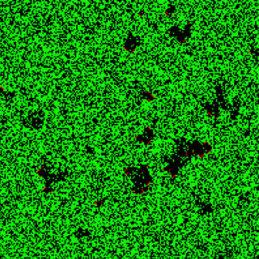
      <br>
      <strong>Forest-fire model</strong>
    </td>
    <td align="center">
      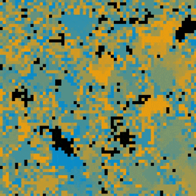
      <br>
      <strong>Cyclic automata</strong>
    </td>
    <td align="center">
      
      <br>
      <strong>Hodgepodge Machine</strong>
    </td>
  </tr>

  <tr>
    <td align="center">
      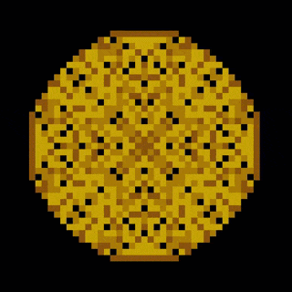
      <br>
      <strong>Abelian sandpile model</strong>
    </td>
    <td align="center">
      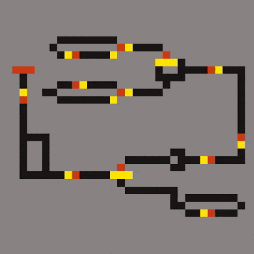
      <br>
      <strong>Wireworld</strong>
    </td>
    <td align="center">
      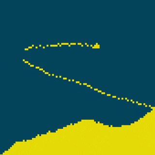
      <br>
      <strong>Falling sand</strong>
    </td>
  </tr>

<!--
  <tr>
    <td align="center">
      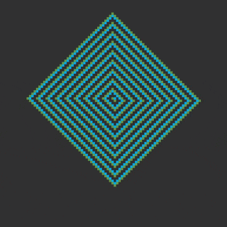
      <br>
      <strong>Greenberg-Hasting</strong>
    </td>
  </tr>
-->
</table>

### How to compile

```bash
# Run these commands from the root directory
mkdir build
cd build
cmake ..
make
./cellauto
```

### Controls
*Keyboard and mouse events are not processed if the mouse is hovering over the ImGui window*

+ **Spacebar :** Pause/Resume
+ **Middle click :** Move the camera
+ **Left click :** Make cells alive/dead
+ **Mouse wheel :** Zoom in/out
+ **Escape :** Close the window

### Demo videos

<table align="center">
  <tr>
    <td align="center">
      <a href="https://www.youtube.com/watch?v=l4J-b-8SOkM">
        
      </a>
      <br>
      <strong>Game of Life, Langton's Ant and 1D Automata</strong>
    </td>
    <td align="center">
      <a href="https://www.youtube.com/watch?v=bSjD-3EoghI">
        
      </a>
      <br>
      <strong>Life-like Automata</strong>
    </td>
  </tr>
  <tr>
    <td align="center">
      <a href="https://www.youtube.com/watch?v=1YaUlBjD1TQ">
        
      </a>
      <br>
      <strong>Cyclic, Wireworld, Hodgepodge, Sandpile and Forest-fire model</strong>
    </td>
  </tr>
</table>

### Automata settings

<!--
<table align="center">
  <tr>
    <td align="center">
      
      <br>
      <strong>General settings</strong>
    </td>
    <td align="center">
      
      <br>
      <strong>Color settings</strong>
    </td>
  </tr>
</table>
<br>
-->

<p align="center">
<em>The available automata can be selected from the drop-down list in the Automata tab. You can choose the neighborhood type (Moore or Von Neumann). In addition, some have also specific parameters (as shown below)</em>
</p>

<table>
  <tr>
    <td>
      
    </td>
    <td style="padding-left: 15px;">
      <strong>Elementary cellular automata</strong><br>
      <strong>State :</strong> 2<br>
      <strong>Parameters :</strong> Rule [0-255]<br>
      One-dimensional cellular automata (the rendered grid is obtained by stacking the generations). The new state of a cell is determined with the state (from the previous generation) of the same cell and its left and right neighbors. Each of the 8 possible three-cell neighborhood configurations is mapped to either 0 or 1 by a fixed 8-bit rule.
    </td>
  </tr>

  <tr>
    <td>
      
    </td>
    <td style="padding-left: 15px;">
      <strong>Game of Life</strong><br>
      <strong>State :</strong> 2<br>
      <strong>Parameters :</strong> Birth (numbers of alive neighbors a dead cell needs to become alive), Survive (numbers of alive neighbors a living cell needs to stay alive)<br>
      At each iteration, a dead cell becomes alive if the number of living neighbors is in Birth, and a living cell survives if the number of living neighbors is in Survive. All other cells die or remain dead.
    </td>
  </tr>

  <tr>
    <td>
      
    </td>
    <td style="padding-left: 15px;">
      <strong>Langton's Ant</strong><br>
      <strong>State :</strong> 2<br>
      <strong>Parameters :</strong> None<br>
      This automaton represents an ant that moves on a grid. At each step, if the cell is alive, the ant turns 90° clockwise, makes the cell dead, and moves forward one cell. If the cell is dead, the ant turns 90° counterclockwise, makes the cell alive, and moves forward one cell.
    </td>
  </tr>

  <tr>
    <td>
      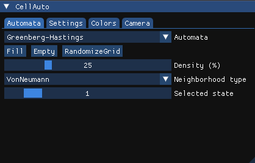
    </td>
    <td style="padding-left: 15px;">
      <strong>Greenberg-Hastings</strong><br>
      <strong>State :</strong> 3<br>
      <strong>Parameters :</strong> None<br>
      Each cell is assigned one of three states : resting (0), excited (1), refractory (2). The state of each cell is updated by the following rules : 
        <ul>
          <li>An excited cell becomes refractory</li>
          <li>A refractory cell becomes resting</li>
          <li>A resting cell becomes excited if at least one of its neighbors is excited, otherwise it will stay in resting state</li> 
        </ul>
    </td>
  </tr>

  <tr>
    <td>
      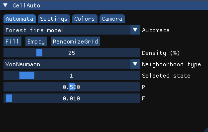
    </td>
    <td style="padding-left: 15px;">
      <strong>Forest-fire model</strong><br>
      <strong>State :</strong> 3<br>
      <strong>Parameters :</strong> P [0., 1.], F [0., 1.]<br>
      A cell can be empty (0), occupied by a tree (1), or burning (2). At each iteration, burning cells turn into empty, and a tree burns if at least one neighbor is burning. In addition, a tree could ignite with probability F, and an empty cell may grow a tree with probability P.
    </td>
  </tr>

  <tr>
    <td>
      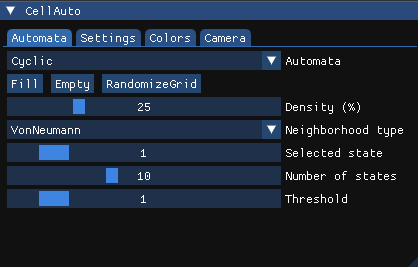
    </td>
    <td style="padding-left: 15px;">
      <strong>Cyclic automata</strong><br>
      <strong>State :</strong> Between 1 and 25<br>
      <strong>Parameters :</strong> Threshold [0, 8]<br>
      Each cell can take one of n states (from 0 to n-1). At each generation, a cell in state k advances to state (k+1) mod n if at least one of its neighbors is in that next state, otherwise it remains in state k. Thus, the next state for a cell in state n-1 is 0.
    </td>
  </tr>

  <tr>
    <td>
      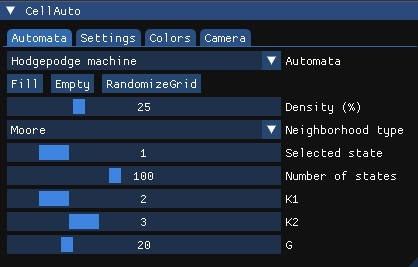
    </td>
    <td style="padding-left: 15px;">
      <strong>Hodgepodge machine</strong><br>
      <strong>State :</strong> Between 3 and 256<br>
      <strong>Parameters :</strong> K1 [1, 9], K2 [1, 9], G [0, 100]<br>
      Each cell can take one of n states : healthy (0), infected (1 to n-2), or ill (n-1). The state of each cell is updated according to the following rules : 
        <ul>
          <li>If the cell is ill, it becomes healthy</li>
          <li>If the cell is healthy, its new state is ⌊A/K1⌋ + ⌊B/K2⌋</li>
          <li>If the cell is infected, its new state is ⌊S/(A+B+1)⌋+G</li> 
        </ul>
      Here, A is the number of infected neighbors, B is the number of ill neighbors, and S is the sum of the states of the cell and its neighbors. ⌊X⌋ means the integer part of X.
    </td>
  </tr>

  <tr>
    <td>
      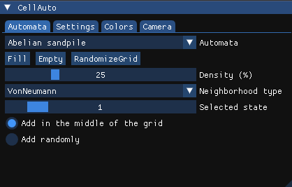
    </td>
    <td style="padding-left: 15px;">
      <strong>Abelian sandpile model</strong><br>
      <strong>State :</strong> 4<br>
      <strong>Parameters :</strong> Adding position (random or grid center)<br>
      Each cell contains a number of grains (state n means n grain(s)). At each iteration, any cell with 4 grains topples : it loses 4 grains, and each of its (Von Neumann) neighbors receives one grain. This process repeats until all cells have less than 4 grains. All topplings at a given iteration are considered simultaneous.
    </td>
  </tr>

  <tr>
    <td>
      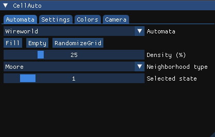
    </td>
    <td style="padding-left: 15px;">
      <strong>Wireworld</strong><br>
      <strong>State :</strong> 4<br>
      <strong>Parameters :</strong> None<br>
      Each cell can be in one of four states : empty (0), electron head (1), electron tail (2), or conductor (3). At each iteration, electron heads become electron tails, electron tails become conductors, and conductors become electron heads if exactly one or two of their neighbors are electron heads, otherwise they remain conductors.
    </td>
  </tr>

  <tr>
    <td>
      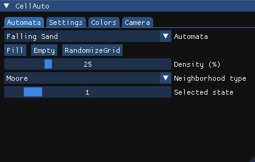
    </td>
    <td style="padding-left: 15px;">
      <strong>Falling sand</strong><br>
      <strong>State :</strong> 4<br>
      <strong>Parameters :</strong> None<br>
      Each cell can be empty (0) or contain a particle of type sand (1), water (2) or stone (3). At each iteration :
      <ul>
        <li>Stone cells never move</li>
        <li>A sand cell moves down if the cell below is empty or contains water. If the cell below is occupied but the bottom-left or the bottom-right cell is empty, the sand moves to one of them (if both are free, choose randomly).</li>
        <li>A water cell moves down if the cell below is empty. If the cell below is occupied but the bottom-left or the bottom-right cell is empty, the water moves to one of them (if both are free, choose randomly). If none of these cells are free, but the left or right cell is empty, the water moves horizontally to one of them (if both are free, choose randomly)</li>
      </ul>
      Particles can't move outside the grid.
    </td>
  </tr>
  
</table>
