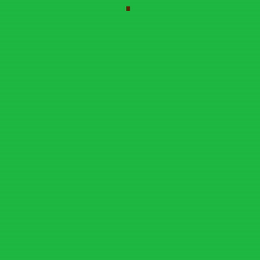
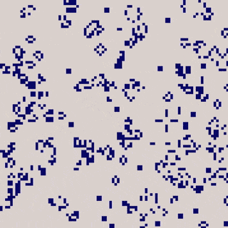
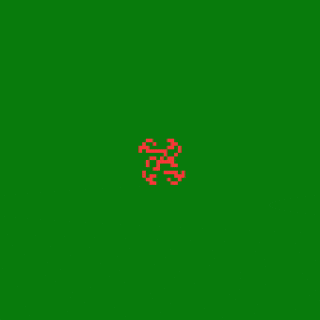
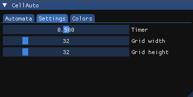
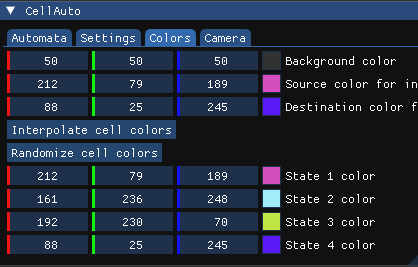
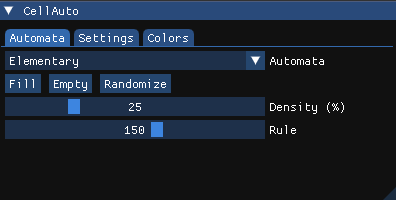
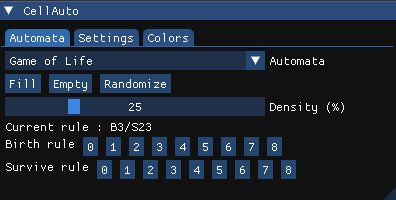
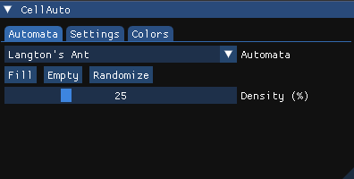

# CellAuto (WIP)

<table align="center">
  <tr>
    <td align="center">
      
      <br>
      <strong>Elementary cellular automata</strong>
    </td>
    <td align="center">
      
      <br>
      <strong>Conway's Game of Life</strong>
    </td>
    <td align="center">
      
      <br>
      <strong>Langton's Ant</strong>
    </td>
  </tr>
</table>

### How to compile

```bash
# Run these commands from the root directory
mkdir build
cd build
cmake ..
make
./cellauto
```

### Controls
*Keyboard and mouse events are not processed if the mouse is hovering over the ImGui window*

+ **Spacebar :** Pause/Resume
+ **Middle click :** Move the camera
+ **Left click :** Make cells alive/dead
+ **Escape :** Close the window

### Demo videos

<table align="center">
  <tr>
    <td align="center">
      <a href="https://www.youtube.com/watch?v=l4J-b-8SOkM">
        
      </a>
      <br>
      <strong>Game of Life, Langton's Ant and 1D Automata</strong>
    </td>
  </tr>
</table>

### ImGui settings

<table align="center">
  <tr>
    <td align="center">
      
      <br>
      <strong>General settings</strong>
    </td>
    <td align="center">
      
      <br>
      <strong>Color settings</strong>
    </td>
  </tr>
</table>

<p align="center">
<em>The available automata can be selected from the drop-down list. Once selected, you can modify their rules (as shown below)</em>
</p>
<table align="center">
  <tr>
    <td align="center">
      
      <br>
      <strong>Elementary cellular automata</strong>
    </td>
    <td align="center">
      
      <br>
      <strong>Game of Life</strong>
    </td>
    <td align="center">
      
      <br>
      <strong>Langton's Ant</strong>
    </td>
  </tr>
</table>